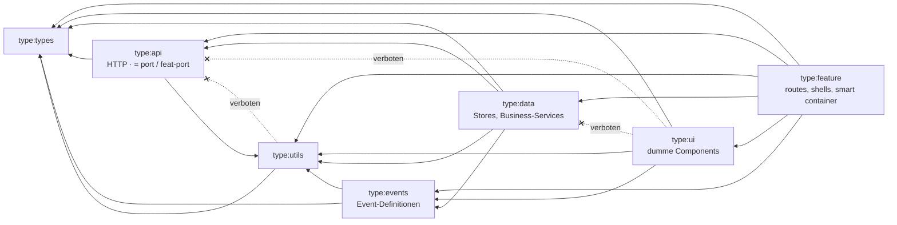
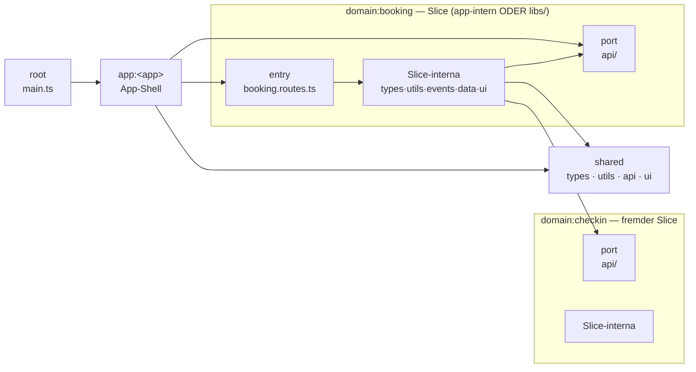
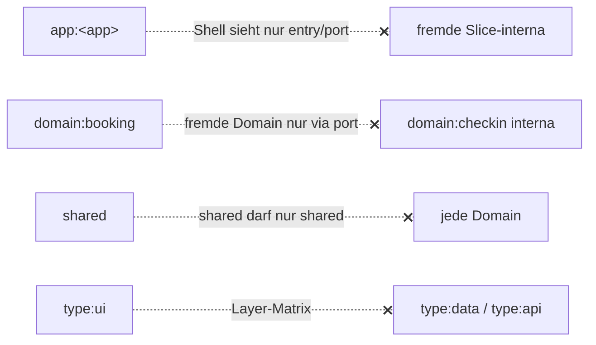
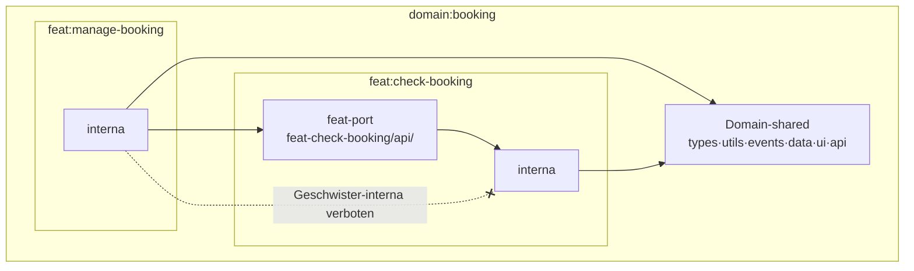
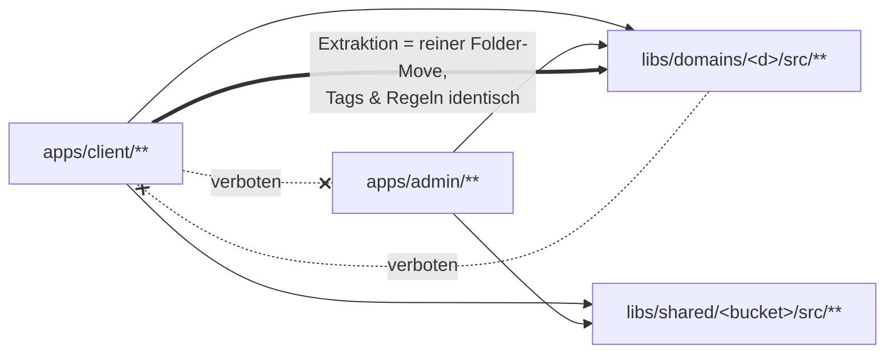

# Sheriff Blueprint — Architektur & Regelwerk

> **Branch `feat/nx-blueprint`:** Das Regelwerk unten ist hier **ohne Sheriff** umgesetzt, mit einer Nx-Lib pro Slice × Layer, Tags und `@nx/enforce-module-boundaries`. Siehe [`nx-umsetzung.md`](./nx-umsetzung.md). Pfade, `sheriff.config.ts` und die Verifikation weiter unten beschreiben den Sheriff-Stand. Auf `feat/nx-blueprint-explicit-config` heißt der Layer `data` `state` (Tag `type:state`).

Skalierbare `sheriff.config.ts` für alle Projekte. Funktioniert identisch für app-interne Domains (`apps/<app>/src/app/domains/…`) und extrahierte Nx-Libs (`libs/domains/…`) — Extraktion = reiner Folder-Move, null Regeländerung.

## Grundprinzip

**Alles ist ein Slice mit derselben Layer-Matrix; Zugriff von außen nur über einen Port.**

- Domain-`api/` → Tag `port` — public API für andere Domains
- Feat-`api/` → Tag `feat-port` — public API für Geschwister-Feats, nie sichtbar außerhalb der Domain
- Shared-Features (auth, layout, …) = Domains mit gleichem Mechanismus (deep modules, schmale API)

## Struktur

```
apps/<app>/src/
  main.ts                      root (implizites Root-Modul)
  app/                         app:<app>        Shell: app.ts, app.config.ts, app.routes.ts
    shared/                    shared + type:*  dumm: types/utils/api/ui (KEIN data!)
    auth/  layout/  …          domain:<sf>      Shared-Features direkt im Root (Slice-Shape)
    domains/<domain>/          domain:<domain>  Slice-Shape (s.u.)

libs/
  shared/<bucket>/src/         shared + type:<bucket>
  auth/src/  layout/src/  …    domain:<sf>      gleiches Slice-Shape
  domains/<domain>/src/        domain:<domain>  gleiches Slice-Shape

Slice-Shape (Domain, Shared-Feature — app-intern oder Lib):
  <slice>.routes.ts / shell    + entry           einziger Einstieg für App-Shell
  types/   utils/   events/   data/   ui/
  api/                         + port            PUBLIC PORT
  feat-<feat>/                 + feat:<feat>     strikt privat, gleiche Buckets
    api/                       + feat-port       public für Geschwister-Feats
```

Shared-Features liegen direkt im Root (kein `shared-features/`-Ordner) und werden in der Config **explizit gelistet** (`sharedFeatures = ['auth', 'layout']`) — ein Platzhalter auf Root-Ebene würde auch `domains` und `shared` schlucken. Eine Zeile pro neuem Shared-Feature.

### Modul-private Files: `internal/`

Barrel-less gibt jedem Modul per Default einen privaten Ordner (`encapsulationPattern: 'internal'`): ein **top-level** `internal/` in einem Modul ist nur aus diesem Modul heraus importierbar — sogar die eigene Domain bekommt eine `encapsulation`-Violation. Kein Tag, keine Regel nötig. Beispiel: `checkin/data/internal/checkin.mapper.ts` (DTO→Model-Mapping, nur vom `CheckinStore` benutzt). Achtung: nur die oberste Ebene zählt — `data/foo/internal/` wird NICHT erkannt.

## Layer-Matrix (type-Achse)

| from \ to | types | utils | events | api | data | ui | feature |
|---|---|---|---|---|---|---|---|
| **types**   | ✓ | ✗ | ✗ | ✗ | ✗ | ✗ | ✗ |
| **utils**   | ✓ | ✓ | ✗ | ✗ | ✗ | ✗ | ✗ |
| **events**  | ✓ | ✓ | ✓ | ✗ | ✗ | ✗ | ✗ |
| **api**     | ✓ | ✓ | ✗* | ✓ | ✗ | ✗ | ✗ |
| **data**    | ✓ | ✓ | ✓ | ✓ | ✓ | ✗ | ✗ |
| **ui**      | ✓ | ✓ | ✓ | ✗ | ✗ | ✓ | ✗ |
| **feature** | ✓ | ✓ | ✓ | ✓ | ✓ | ✓ | ✓ |

*api→events bei Bedarf: `'type:events'` in der `'type:api'`-Regel ergänzen (Einzeiler).

- `data` = Signal Stores + Business-Logic-Services (domain- oder feat-shared)
- `events` = Signal-Store-Events, definition-only (Type + Creator). ui/feature werfen, data handelt → deshalb eigener Bucket, den ui importieren darf (data nicht)
- ui-**lokale** Stores: colocated im ui-Bucket = type:ui bzw. intra-Modul (wird nie geprüft) → erlaubt
- Store-Regel aus README erfüllt: Domain-/Feat-Store (type:data) in ui → Violation

## Scope-Regeln

| von | darf |
|---|---|
| `root` (main.ts) | app:*, entry, port, shared — nur eigene App |
| `app:<app>` (Shell) | eigene App: entry (Slice-Roots), port, shared |
| `domain:<x>` | eigene Domain komplett; fremde Domain/SF nur `port`; shared |
| `feat:<f>` | eigenes Feat; alles außerhalb von `feat-*`-Ordnern; fremde Feats nur `feat-port` |
| `shared` | nur shared (Layer-Matrix gilt weiter) |
| `noTag` | nichts — unkonfigurierte Module fallen sofort auf |

- **App-Isolation:** pfadbasierter `sameApp`-Guard. Ziel in `apps/<x>` ⇒ gleiche App; Libs app-frei; lib→app blockiert. Kein app-Tag pro Modul nötig ⇒ Domain-Tags ortsunabhängig.
- **Cross-Domain-Types:** Port ist einziger Zugang — benötigte Types aus `api/` re-exportieren oder nach `shared/types` promoten.
- **Port mit State (Muster):** Port = Contract (InjectionToken + Interface), Impl in `data/`, Verdrahtung am Slice-Root (`provideAuth()` in `auth.providers.ts`). Konsument injiziert Token aus dem Port, sieht den Store nie.
- **AND-Semantik:** jedes from-Tag muss den Import unabhängig erlauben; ein Tag ist erfüllt, wenn EIN Ziel-Tag passt. Marker (`entry`, `port`, `feat-port`) sind deshalb als from-Tag transparent (`anyTag`) — Constraints kommen von den anderen Achsen.

## Regelwerk als Diagramm

### 1. Layer-Matrix (type-Achse) — gilt in JEDEM Slice, app-intern wie Lib



Selbstkanten (`ui → ui`, `data → data`, …) sind erlaubt und der Übersicht halber weggelassen.

### 2. Scope-Achse — wer darf welchen Slice überhaupt sehen

Erlaubte Zugriffe (durchgezogen) und die Regeln, die sie erzwingen:



Verbotene Zugriffe — jeweils die Regel, die greift:



App-übergreifende Verbote siehe Diagramm 4.

### 3. Feat-Isolation — Geschwister-Feats sind privat



Beide Achsen greifen mit **UND**-Semantik: ein Import ist nur legal, wenn Layer-Matrix **und** Scope-Regel ihn erlauben.

### 4. App-Isolation & Extraktion (`sameApp`, pfadbasiert)



## Naming-Konventionen (load-bearing!)

- `feat-<name>/` — Prefix wird von der Feat-Isolations-Regel per Pfad erkannt
- `domains/` als Eltern-Ordner für Domains; Shared-Features direkt im Root, aber explizit in `sharedFeatures` gelistet
- `internal/` — top-level im Modul = modul-privat (encapsulation-Rule)
- Libs: flach unter `src/` (kein `src/lib/`), **kein Barrel auf Lib-Ebene** (`libs/<d>/src/index.ts` würde die Buckets zu einem Modul verschmelzen und die Layer-Matrix aushebeln)
- **Barrel auf Bucket-Ebene ist erlaubt**: die Port-Datei heißt `api/index.ts`. Die Bucket-Modulgrenze bleibt (`type:api, port`), aber der Import verliert das Datei-Segment.

  **Genau ein Path pro Lib** — der Wildcard löst `.../<domain>/api` selbst auf `api/index.ts` auf, weil TypeScript den Ordner-Index findet:

  ```jsonc
  "@blueprint/domains/booking/*": ["./libs/domains/booking/src/*"]
  ```

  ```ts
  import { Booking, BookingApi } from '@blueprint/domains/booking/api';        // Port
  import bookingRoutes           from '@blueprint/domains/booking/booking.routes'; // entry
  ```

  Der Wildcard löst technisch **alles** auf — er ist keine Zugriffsgrenze, sondern nur Modul-Auflösung. Die Grenze zieht Sheriff über die Tags: `.../booking/data/booking.store` resolved zwar, wird aber geblockt. Bewusst so, damit ein Verstoß als *Architektur*-Fehler mit Regelnamen erscheint statt als „Modul nicht gefunden".

  Härter wäre `exports` in der `package.json` der Lib (Verbotenes wäre gar nicht auflösbar) — verworfen, weil Entwickler `exports` selten selbst pflegen und ein Fehler dort als kryptischer Resolver-Fehler auftritt.

- **Shared-Libs haben kein Bucket-Barrel**: bei `libs/shared/<bucket>/src` **ist die Lib der Bucket** (der Bucket-Name steckt im Lib-Namen), es gibt keinen Unterordner zum Kürzen. Import direkt auf die Datei: `@blueprint/shared/utils/format-date`.

- **Jede Lib braucht ein `tsconfig.json`** neben `src/` — fehlt es, bricht die `dependency-rule` dort mit einem internen Fehler ab **statt zu prüfen** (Gotcha 6). Die Lib ist dann faktisch ungeschützt, ohne dass etwas rot wird.

## Varianten-Vergleich

| | Variante | Pro | Contra |
|---|---|---|---|
| **A ✅** | Eine Root-Config, Platzhalter für Apps+Libs, pfadbasierte App-Isolation | Eine Regelsprache; Tags identisch vor/nach Extraktion (Zero-Config-Refactor); Port auf Bucket-Ebene; Slice-Generator hält Config klein | Key-Reihenfolge dokumentationspflichtig; Guard-Funktionen = eigener Code |
| B | Config je App/Lib | kleine Configs, Team-Ownership | Duplikation & Drift; App-Isolation nicht ausdrückbar; widerspricht "ein Blueprint" |
| C | Sheriff nur intern + Nx-Boundaries für Libs | Nx-native | Nx ist projekt-granular: "nur api-Bucket public" nicht ausdrückbar ohne Lib-pro-Bucket-Explosion (killt 1 Lib/Domain); zwei Regelsprachen |

Nx `@nx/enforce-module-boundaries` bleibt als grobes Netz (Projekt-Zyklen, buildable-Constraint). `checkDynamicDependenciesExceptions: ["@blueprint/**"]` nötig: statischer Port-Import in lazy geladene Domain-Lib ist bei uns gewollt (Sheriff governt das).

## Gotchas (verifiziert am Sheriff-0.19-Quellcode)

1. **AND-Semantik + Marker-Tags:** ohne `port: anyTag` dürfte ein api/port-Bucket seine eigenen types nicht importieren (Bug der ursprünglich kopierten Config).
2. **Kein `'*': 'shared'`-Catch-all:** gäbe JEDEM from-Tag Freigabe auf shared-Module und hebelt die Layer-Matrix innerhalb shared aus (utils→api wäre legal; ebenfalls Bug der kopierten Config). Stattdessen shared explizit pro Scope-Regel.
3. **Matching ist first-match-wins in Deklarationsreihenfolge** (nicht most-specific-wins). Unkritisch, weil Leaf-Keys nur komplette Modulpfade matchen — aber Literal-Keys (`shared`) vor Platzhaltern deklarieren.
4. **Verirrte `index.ts`** macht aus einem barrel-less Modul ein Barrel-Modul (alles nicht Re-exportierte wird privat, Modul ggf. `noTag`).
5. **`noTag: noDependencies`**: unkonfigurierte Module fallen sofort auf statt still durchzurutschen.
6. **CLI `sheriff verify`** prüft nur import-erreichbare Files ab Entry Point — ESLint ist die Autorität, CLI der CI-Cross-Check. Jede Lib braucht ein `tsconfig.json` neben dem Entry.
7. **TS 6:** `paths`-Targets relativ angeben (`./libs/…`), `baseUrl` ist deprecated.
8. **Intra-Modul-Imports werden nie geprüft** — deshalb sind component-lokale Stores im ui-Bucket frei.

## Entscheidungslog

| # | Entscheidung |
|---|---|
| D1 | Type-Achse: types/utils/events/api/data/ui/feature (api=http, data=stores getrennt) |
| D2 | ui: nur types/utils/events + lokale Stores; NICHT api, NICHT data |
| D3 | Cross-Domain nur via Port (= api-Bucket); Types re-exportieren/promoten |
| D4 | Kein core-Scope; Shared-Features (auth, layout) als Domain-Slices mit Port, direkt im App-Root, explizit gelistet |
| D5 | Geschwister-Feats strikt privat; Austausch nur via feat-port |
| D6 | events als eigener Bucket (type:events) |
| D7 | Kein shared/data — stateful Singletons gehören in shared-features |
| D8 | Libs ohne Barrel, Wildcard-Aliase, 1 Lib/Domain, flach unter src/ |
| D9 | App-Isolation pfadbasiert (sameApp), nicht per Tag |

## Verifikation

```sh
npx sheriff list apps/client/src/main.ts   # Module + Tags, keine noTag erwartet
npx sheriff verify                          # alle entryPoints
npx nx run-many -t lint                     # ESLint = Autorität
npx nx build client
```

Negativbeispiele: In den Quellen markieren Kommentare `// sheriff-violation-example: import …` verbotene Imports (ui→data, ui→api, utils→api, cross-domain internals, SF internals, Geschwister-Feat internals, shell→ui, Import aus fremdem `internal/` → encapsulation-Rule). Einkommentieren ⇒ genau diese Violations feuern.

## Teilen über Projekte: `@berger-engineering/sheriff-blueprint`

Regeln + Generatoren leben in `packages/sheriff-blueprint` (im Repo per pnpm-workspace gelinkt, `prepare`-Build; für andere Projekte in die Registry publishen). Projekte schreiben nur noch:

```ts
export const config = createSheriffConfig({
  sharedFeatures: ['auth', 'layout'],
  entryPoints: { client: 'apps/client/src/main.ts' },
});
```

- ESLint: `sheriff.configs.all` + `nxModuleBoundariesOptions('@blueprint')`
- Generatoren: `nx g @berger-engineering/sheriff-blueprint:domain|feat|shared-feature`
- Technische Randbedingung: Sheriff transpiliert nur die eine Config-Datei und evalt sie → das Package MUSS gebaut in node_modules liegen; relative Imports in sheriff.config.ts gehen nicht
- Tests: `nx test sheriff-blueprint` — Regel-Funktionen (unit), Generatoren (devkit-Tree), e2e gegen das echte Workspace (sheriff verify + eslint-Violations)

## Neues Projekt aufsetzen

1. Package installieren, `sheriff.config.ts` (3 Zeilen, s.o.) + ESLint-Block anlegen
2. Ordnerkonventionen einhalten (`domains/`, Shared-Features im Root + `sharedFeatures`-Liste, `feat-`, Buckets) — oder Generatoren nutzen
3. Domain extrahieren: Ordner nach `libs/domains/<d>/src` moven, Alias + `tsconfig.json` + `project.json` ergänzen (macht der `domain`-Generator automatisch), Imports von relativ auf Alias umstellen — Regeln unverändert
